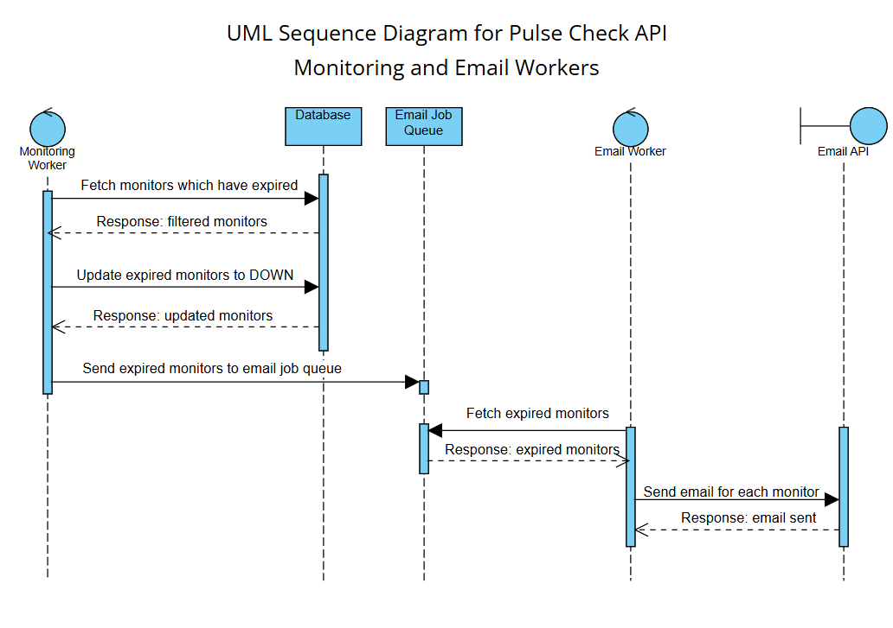
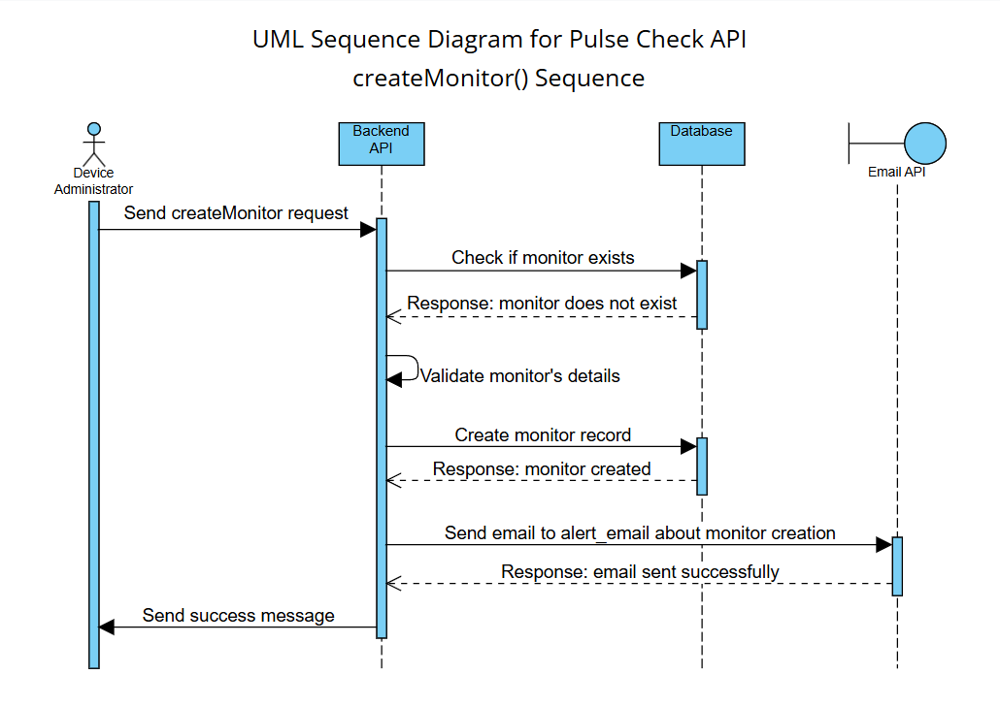
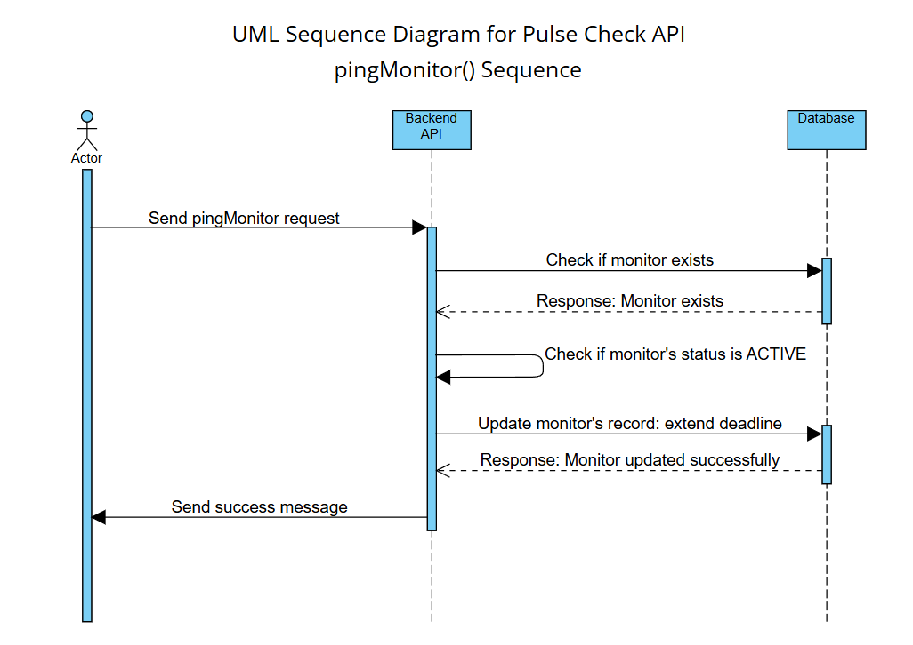
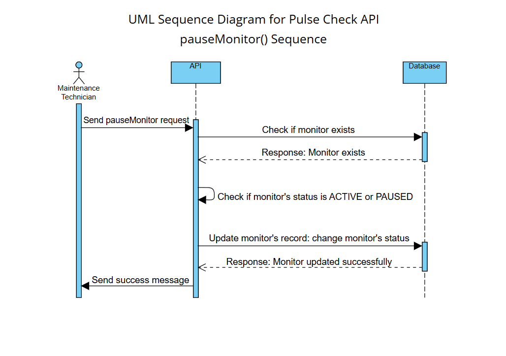

# Pulse-Check-API

## 1. Overview
This is a backend service for a deadman's switch API.

The server handles monitor for devices. Each device must ping the server before its monitor reaches its deadline. Sending a ping will reset the deadline.

If the device does not send the ping before the deadline, the monitor will raise an alert and an email will be sent out.

This server was built using TypeScript on Node.JS. The server makes use of a PostgreSQL database, BullMQ message queues and a Redis server.

## 2. Details

### Backend API
The backend API is built using the ExpressJS framework. Other frameworks were used, including the following:
1. `prisma`: ORM for database querying.
2. `pg`: Works with Prisma to connect to the PostgreSQL server.
3. `dotenv`: For loading `.env` files.
4. `zod`: For creating schemas for data validation.

### Database
For this service, a database was created on [`NeonDB`](https://neon.com/), a service for hosting serverless PostgreSQL databases. The connection string for the database was added to the `.env` file.

### BullMQ
[`BullMQ`](https://docs.bullmq.io/) is a Node.JS library for managing job queues. It works in conjunction with [`Redis`](https://redis.io/) for cache storage.

In this project, BullMQ is used to manage workers and schedule jobs for them.

### Architecture
Each device which will be pinging the service will need to have a monitor created for it first. The monitor will be created as a record in the database.

The model for the monitor is detailed below:

| Field | Description |
|--|--|
| device_id | Device ID for the device pinging the monitor. |
| timeout | How much the deadline should be extended by for each ping. |
| alert_email | The email address to be mailed when the monitor hits the deadline. |
| status | The current status of the monitor: `ACTIVE`, `PAUSED`, `DOWN`. |
| deadline | The datetime before which the monitor has to be pinged, otherwise, the monitor expires.

The service consists of two parts: the `REST API` and the `BullMQ Workers`.

The REST API has endpoints for creating, pinging and pausing monitors, as well as fetching, editing and deleting monitors. It handles most of the setting up of the monitors and is triggered by API calls from HTTP requests.

The BullMQ workers run automatically. They are responsible for filtering out monitors whose deadlines have being passed, sending alerts and sending emails to the appropriate address.

There are two main types of workers: one for identifying expired monitors and making internal alerts, and another for email notifications.

## Architecture Diagrams
The following diagrams explain the architecture of the system.

### Sequence Diagram for Workers


### Sequence Diagram for Monitor Creation (createMonitor)


### Sequence Diagram for Monitor Pinging (pingMonitor)


### Sequence Diagram for Monitor Pausing (pauseMonitor)


## 3. Installation and Running

### Set-up

1. Clone or pull this repository.
```bash
git clone "https://github.com/Delasi-Richards/Pulse-Check-API"
```
or 
```bash
git remote add origin "https://github.com/Delasi-Richards/Pulse-Check-API"
git pull origin main
```

2. Inside the root directory of the repository is a `.env.template` file. Copy this file and rename it to `.env`. Fill the environment variables with their corresponding values.
```python
PORT=               # Port to run the server on
DATABASE_URL=       # Connection string for the database
REDIS_URL=          # Connection string for the Redis server
```

3.  Run the following commands to push migrations to the database.
```bash
npm install
npx prisma db push
npx prisma generate
```

### Running
To run a development server, use the following command:
```bash
npm run dev
```
To run a production server, use the following commands:
```bash
npm run build
npm start
```

## API Documentation

### POST {{SERVER}}/api/v1/monitors
- Create a new monitor for a device.
- Accepts a JSON request with the following fields:

    | Field | Description |
    |--|--|
    | `device_id` | A string in the form of `device-xxx` (`xxx` represents a number). **The ID must be unique**. |
    | `timeout` | Time interval in minutes during which the monitor must be pinged. **Accepts an integer value**. |
    | `alert_email` | Email address to be alerted when the monitor expires. **Must be in a valid email format**. |

- Request example:
    ```json
    {
        "device_id": "device-001",
        "timeout": 15,
        "alert_email": "hello@gmail.com"
    }
    ```

- Returns a JSON object with a success message if the monitor has been created successfully, otherwise an error.

### POST {{SERVER}}/api/v1/monitors/:id/heartbeat
- Endpoint for ping requests to the monitor.

- The selected monitor's status must be set to `ACTIVE`, and the deadline must not have been past.
- This endpoint refreshes the deadline. It extends the deadline based on the value in the timeout field.
- The `:id` parameter accepts the device ID for the monitor to be pinged.
- Returns a JSON object with a success message if the monitor has been pinged successfully, otherwise an error.

### POST {{SERVER}}/api/v1/monitors/:id/pause
- Endpoint for pausing or unpausing a monitor.
- If a monitor is to be disable temporarily, then this endpoint is used to do so. It is also used to unpause a disabled monitor.

- A monitor with the specified device ID must exist, otherwise an error is thrown.
- If the monitor's status is set to `ACTIVE`, then the monitor is paused. If the monitor's status is set to `PAUSED`, then the monitor is unpaused.
- The monitor's deadline is automatically refreshed, to prevent the deadline from expiring when the monitor is unpaused.
- The `:id` parameter accepts the device ID for the monitor to be paused.
- Returns a JSON object with a success message if the monitor has been paused or unpaused successfully, otherwise an error.

### POST {{SERVER}}/api/v1/monitors/:id/reset
- Resets a monitor which has expired.

- This endpoint is meant to reset monitors for devices which went offline and did not ping within the timeout interval. After the devices are fixed, this endpoint is used to bring the monitor back online.

- This endpoint only works with monitors whose statuses are set to `DOWN`.

- The endpoint sets the monitor's status to `ACTIVE` and refreshes the deadline based on the value in the timeout field.
- The `:id` parameter accepts the device ID for the monitor to be reset.
- Returns a JSON object with a success message if the monitor has been reset successfully, otherwise an error.

### GET {{SERVER}}/api/v1/monitors
- Returns all available monitors.
- Returns a JSON object with the monitor objects.

### GET {{SERVER}}/api/v1/monitors/:id
- Returns the monitor for the device ID specified using the `:id` parameter.

- A monitor with the specified device ID must exist, otherwise an error is thrown.
- The `:id` parameter accepts the device ID for the monitor to be returned.
- Returns a JSON object with the monitor object if the monitor exists and can be fetch successfully, otherwise an error.

### PUT {{SERVER}}/api/v1/monitors
- Update a monitor.
- This endpoint is used to edit the timeout and alert email fields of a monitor.
- Accepts a JSON request with the following fields:

    | Field | Description |
    |--|--|
    | `device_id` | A string in the form of `device-xxx` (`xxx` represents a number). Represents the monitor to be edited. **The ID must already exist**. |
    | `timeout` | Time interval in minutes during which the monitor must be pinged. **Accepts an integer value**. |
    | `alert_email` | Email address to be alerted when the monitor expires. **Must be in a valid email format**. |

- Request example:
    ```json
    {
        "device_id": "device-001",
        "timeout": 20,
        "alert_email": "hithere@gmail.com"
    }
    ```

- Returns a JSON object with a success message if the monitor has been edited successfully, otherwise an error.

### DELETE {{SERVER}}/api/v1/monitors/:id
- Delete a monitor

- This endpoint is used to delete monitors.
- The status of the monitor is not considered before deletion.

- The `:id` parameter accepts the device ID for the monitor to be reset.
- Returns a JSON object with a success message if the monitor has been reset successfully, otherwise an error.

## Developer's Choice

### Data Validation
For my addition to this project, I decided on adding `field validation` to input fields using `Zod`.

My reasons for this are listed below:

1. Unvalidated data can cause errors during database insertion.

2. Unvalidated data can serve as an attack vector for malicious payloads and SQL injections.

3. Validation ensures that data integrity is maintained in the database.

4. Validation allows for sending of precise feedback to users when errors occur, making them less ambigious and their resolution easier.

Most of the validation is done on data inserted into the `Monitor` model and the device IDs used. The following are the rules used for each field of the `Monitor` model.

| Field | Rule |
|--|--|
| `device_id` | AMust be a string in the form of `device-xxx`. |
| `timeout` | Must be an integer between 1 and 10,080 (one week). |
| `alert_email` | Must be a valid email address. |

### Additional Endpoints
In addition to the above, I also added an endpoint for reseting expired monitors: `POST {{SERVER}}/api/v1/monitors/:id/reset`. This allows for expired monitors to be reset when the device has had its fault corrected.

I also added endpoints for CRUD operations: fetching , editing and deleting monitors.

## 🛑 Pre-Submission Checklist
*Copied from original `README.md file`.*

**WARNING:** Before you submit your solution, you **MUST** pass every item on this list.
If you miss any of these critical steps, your submission will be **automatically rejected** and you will **NOT** be invited to an interview.

### 1. 📂 Repository & Code
- [x] **Public Access:** Is your GitHub repository set to **Public**? (We cannot review private repos).
- [x] **Clean Code:** Did you remove unnecessary files (like `node_modules`, `.env` with real keys, or `.DS_Store`)?
- [x] **Run Check:** if we clone your repo and run `npm start` (or equivalent), does the server start immediately without crashing?

### 2. 📄 Documentation (Crucial)
- [x] **Architecture Diagram:** Did you include a visual Diagram (Flowchart or Sequence Diagram) in the README?
- [x] **README Swap:** Did you **DELETE** the original instructions (the problem brief) from this file and replace it with your own documentation?
- [x] **API Docs:** Is there a clear list of Endpoints and Example Requests in the README?

### 3. 🧹 Git Hygiene
- [x] **Commit History:** Does your repo have multiple commits with meaningful messages? (A single "Initial Commit" is a red flag).
